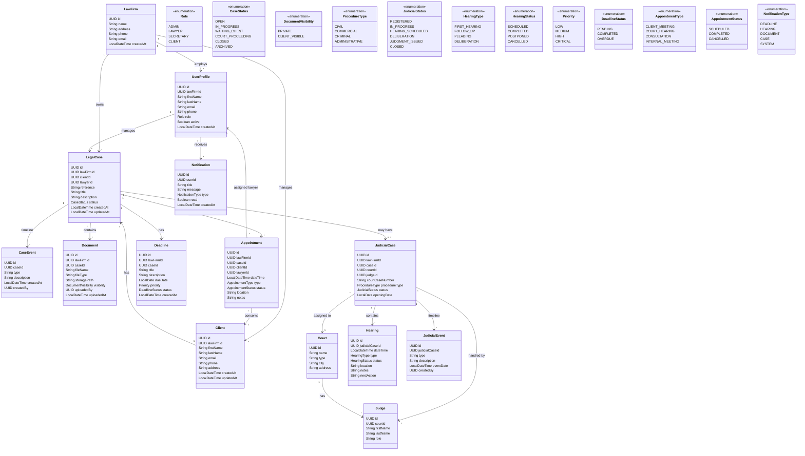

# LegalFlow global business class diagram

This document models the global business domain of LegalFlow, distributed across multiple microservices. It is intentionally not a monolithic JPA model.

## Ownership by service

- Keycloak / Identity: user authentication, identity, roles, tokens
- Client Service: Client
- Case Service: LegalCase, CaseEvent
- Document Service: Document
- Judicial Service: JudicialCase, Court, Judge, Hearing, JudicialEvent
- Deadline Service: Deadline
- Appointment Service: Appointment
- Notification Service: Notification
- LawFirm / UserProfile: business profile and tenant context, stored in the service that owns the tenant business data and linked to the Keycloak principal by subject ID

## Important note

This model describes the legal domain, not a single JPA entity graph. The classes are purposely distributed across microservices using UUID references instead of cross-service JPA relationships.
